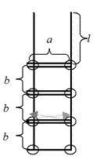

# Функции

Функции — это такие участки кода, которые изолированы от остальной программы и выполняются только тогда, когда вызываются.

Код функции должен размещаться в начале программы, вернее, до того места, где мы захотим воспользоваться функцией.

Функция определяется с помощью инструкции `def`.

```python
def add(x, y):
		return x + y
```

Данная функция производит операцию сложения двух аргументов и возвращает сумму. Первая строчка этого примера является описанием нашей функции. `add` - идентификатор, то есть имя функции. После идентификатора в круглых скобках идет список параметров, которые получает наша функция. Список состоит из перечисленных через запятую идентификаторов параметров. В нашем случае список состоит из двух величин - `x` и `y`. В конце строки ставится двоеточие.

Далее идет тело функции, оформленное в виде блока, то есть с отступом.

Инструкция `return` может встречаться в произвольном месте функции, ее исполнение завершает работу функции и возвращает указанное значение в место вызова. Если функция не возвращает значения, то инструкция return используется без возвращаемого значения. В функциях, которым не нужно возвращать значения, инструкция return может отсутствовать.

Соответственно теперь мы можем вызвать эту функцию в любой части программы и она вернет нам сумму.

# Ввод / вывод

Как уже обсуждали раньше для вывода значений на экран есть функция print(). Внутри круглых скобок через запятую мы пишем то, что хотим вывести.

Для ввода данных в программу мы используем функцию `input()`. Она считывает одну строку.

```python
print('Как вас зовут?')
name = input()  # считываем строку и кладём её в переменную name
print('Здравствуйте, ' + name + '!')
```

Мы будем писать программы, которые считывают данные, перерабатывают их и выводят какой-то результат. При запуске на компьютере такие программы считывают данные, которые пользователь вводит с клавиатуры, а результат выводят на экран.

# Объекты

В Питоне все данные называются объектами. Число 2 представляется объектом «число 2», строка `'hello'` – это объект «строка `'hello'`».

Каждый объект относится к какому-то типу. Строки хранятся в объектах типа `str`, целые числа хранятся в объектах типа `int`, дробные числа (вещественные числа) — в объектах типа `float`. Тип объекта определяет, какие действия можно делать с объектами этого типа. Например, если в переменных `first` и `second` лежат объекты типа `int`, то их можно перемножить, а если в них лежат объекты типа `str`, то их перемножить нельзя:

```python
first = 5
second = 7
print(first * second)
first = '5'
second = '7'
print(first * second)
```

Чтобы преобразовать строку из цифр в целое число, воспользуемся функцией `int()`. Например, `int('23'`) вернет число 23.

# Задачи

Во всех задачах считывайте входные данные через `input()` и выводите ответ через `print()`. Начиная с п.4.1 программы должны представлять собой функцию.

1. Напишите программу, которая считывает три числа и выводит их сумму. Каждое число записано в отдельной строке.

2. Напишите программу, которая считывает длины двух катетов в прямоугольном треугольнике и выводит его площадь. Каждое число записано в отдельной строке. Формула площади треугольника: `1/2 * a*b`

3. Дано число n. С начала суток прошло n минут. Определите, сколько часов и минут будут показывать электронные часы в этот момент. Программа должна вывести два числа: количество часов (от 0 до 23) и количество минут (от 0 до 59). Следует предусмотреть случай, когда количество введенных минут больше чем кол-во минут в сутках.

4. Обувная фабрика собирается начать выпуск элитной модели ботинок. Дырочки для шнуровки будут расположены в два ряда, расстояние между рядами равно `a`, а расстояние между дырочками в ряду `b`. Количество дырочек в каждом ряду равно `N`. Шнуровка должна происходить элитным способом “наверх, по горизонтали в другой ряд, наверх, по горизонтали и т.д.” (см. рисунок). Кроме того, чтобы шнурки можно было завязать элитным бантиком, длина свободного конца шнурка должна быть l.

   Напишите функцию, которая получает на вход четыре натуральных числа `a`, `b`, `l` и `N` - именно в таком порядке - и должна вывести одно число - искомую длину шнурка.

   

   1. Преобразуйте программу в функцию.

5. Напишите функцию, которая вычисляет наименьшее из трех чисел и выводит на экран.

6. Заданы две клетки шахматной доски. Если они покрашены в один цвет, то выведите слово "Да", а если в разные цвета — то "Нет". Программа получает на вход четыре числа от 1 до 8 каждое, задающие номер столбца и номер строки сначала для первой клетки, потом для второй клетки.

7. Дано натуральное число. Требуется определить, является ли год с данным номером високосным. Если год является високосным, то выведите "Да", в обратном случае - "Нет".  Стоит помнить, что в соответствии с григорианским календарем, год является високосным, если его номер кратен 4, но не кратен 100, а также если он кратен 400.

8. Даны три целых числа. Определите, сколько среди них совпадающих. Программа должна вывести одно из чисел: 3 (если все совпадают), 2 (если два совпадает) или 0 (если все числа различны).

9. Шоколадка имеет вид прямоугольника, разделенного на `n`×`m` долек. Шоколадку можно один раз разломить по прямой на две части. Определите, можно ли таким образом отломить от шоколадки часть, состоящую ровно из `k` долек. Программа получает на вход три числа: `n`, `m`, `k` и должна вывести "Да" или "Нет".