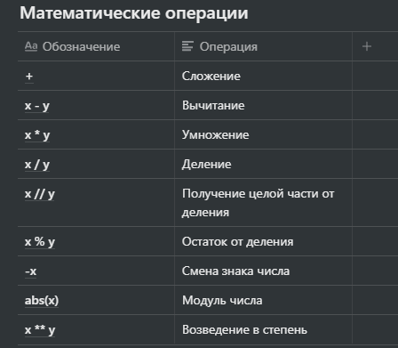

# Общая информация по курсу

Все материалы будут выкладываться в git-репозиторий.

Меня можно найти либо на кафедре (ауд. 209), либо написать мне в телеграмм [t.me/stsdmchv](http://t.me/stsdmchv) или найти по логину @stsdmchv в телеграмме или вконтакте.

Информация для тех кто еще не пересекался с информатикой. Для введение в тему есть отличный курс на 25 занятий по Computer Science под название CS50. Он является не обязательным, но отлично введет в курс дела. CS50 — [clck.ru/JJuPq](http://clck.ru/JJuPq)

Если вам вдруг покажется, что материала недостаточно или не совсем понятно, вы можете пройти курс на платформе Hexlet, который будет доступен сразу после регистрации.

https://clck.ru/PsT6s — это бесплатный курс Python

Если кому-то не нравятся курсы, но нравятся книги, то вы можете прочитать книгу A Byte of Python, в русской интерпретации Укус питона.

Для успешного получения зачета автоматом вам нужно будет выполнить все задачи с наших практик и выгрузить их в git-репозиторий, также следует сделать по 2 код-ревью решений задач двух ваших одногруппников на ваш личный выбор. Код ревью должно быть на решения задание которые начнутся с 10 недели (5 занятия).

# Установка Python

Скачиваете с сайта [Python.org](http://python.org) → Downloads → Python 3.9.7

Запускаете установщик, ставите галочку "Add Path"

Запускаете консоль (cmd) и выполняете команду python -V (Linux python3 -V)

По средам программирования. Для маленьких проектов я советую использовать Visual Studio Code, для больших PyCharm, но это не является строгим правилом.

JetBrains IDE PyCharm — [jetbrains.com](http://jetbrains.com)

# Установка Visual Studio Code

Скачиваете приложение, принимаете условия, выбираете все галочки в разделе "Другое" (Other) и нажимаете установить.

Visual Studio Code — [clck.ru/9Yecp](http://clck.ru/9Yecp)

Настройка VSC — [clck.ru/XD4zB](http://clck.ru/XD4zB)

# Установка и настройка Git

Git — это система контроля версий. Она позволяет вносить изменения в код или что-либо еще хранящееся в репозитории, сохраняя предыдущие версии изменяемого файла.

Для того чтобы сохранить состояние вам следует явно это указать Git'у.

```bash
git add . # точка - отмечает все измененные файлы для записи изменений
git commit -m "внесены изменения"
git push
```

Последняя команда позволяет записать изменения на удаленном репозитории и в случае если вы удалите папку или что-то случится с вашим компьютером, вы сможете скачать последние обновленные вами данные с сервера.

В ряде случаев потребуется предпринять дополнительные действия, но об этом вы можете прочитать в документации к Git.

Скачать git — https://git-scm.com/

Учебник по git — https://git-scm.com/book/ru/v2

Для установки вы можете в первый раз просто проклацать кнопкой "Далее" все экраны до момента пока не начнется установка.

GitHub — [github.com](http://github.com)

Пока идет установка git, заходим на сайт GitHub и создаем репозиторий. Репозиторий называете своей фамилией и инициалами на английском языке. Если кому-то удобнее использовать GitLab или BitBucket ничего не имею против, главное чтобы я и ваши одногруппники могли получить к ним доступ и просмотреть ваши работы.

Далее заходим в Настройки и выбираем GPG и SSH ключ.

Открываем консоль и создаем SSH ключ.

```bash
ssh-keygen -t ed25519 -C "vsuet[@](<mailto:your_email@example.com>)vsuet.ru"
```

Он потребуется чтобы GitHub мог идентифицировать и вносить изменения в репозиторий. После ввода этой команды от нас потребуют ввести путь где будет хранится публичный и закрытый файлы ключа, можно оставить без изменений и нажать Enter и дважды ввести пароль который будет защищать закрытый ключ. В рамках нашей практики вы можете оставить пароль пустым и он не будет запрашиваться при осуществлении пушей коммитов, но на работе советую использовать пароль, для сохранности вашей работы и работы ваших коллег.

После выполнения данной команды у вас появится в папке .ssh (C:\Users\stsdmchv\.ssh) файл с расширением .pub . 

Открываете страницу https://clck.ru/XFQsx. Из этого файла вы вставляете весь текст в поле "ключ" и нажимаете "Добавить ssh ключ". Чтобы скачать репозиторий с GitHub следует на компьютере создать папку, где вы будете хранить свои проекты. В ней открыть Git Bash терминал и выполнить

```python
git clone git@github.com:stsdmchv/OP-2022.git
```

где 
```
git@github.com:stsdmchv/OP-2022.git
```
является ссылкой на ваш репозиторий. Получить ее можно нажав на большую зеленую кнопку "Код" внутри репозитория.

На работе репозиторий будет использоваться не только вами, но и вашими коллегами. Чтобы можно было идентифицировать, кто именно написал определенный участок кода используются credentials. В них указываются буквенный идентификатор (в компаниях чаще это ваше Имя и Фамилия и эмейл почта для связи).

Эти данные хранятся на вашем компьютере в папке git. В первый раз использования гита, он попросит вас их указать. Если вдруг этого не произошло это можно сделать явно, зайдя в файл в папке и изменить через блокнот или указать через консоль с помощью двух команд:

```bash
git config --global user.email "you@example.com"
git config --global user.name "Your Name"
```

# Программы в Python

Любая программа состоит из множество строк кода и различных логических конструкций.

```bash
print('hello')
```

является простой программой которая выведет нам слово hello на экран.

Если вы будете использовать PyCharm то в нем можно напрямую вызывать код на исполнение и он запустится с определенной точки. Про точки вызова мы поговорим на одном из следующих занятий и вам про это расскажет на лекции Владимир Владимирович.

В данном случае точкой входа будет являться первая строчка файла который мы вызовем.

В других различных IDE существуют свои варианты запуска и отладки ваших программ. Более подробно описано в документации к ним, которую вы можете найти на сайте разработчиков. Большинство из них уже переведены на простой и понятный русский язык.

Так же для Python существует режим интерпретатора, в котором мы можем выполнять действия напрямую. (`1+1, 'hello'`).

В случае если вы будете использовать VSC удобно будет использовать командную строку для вызова программ. В случае если вы установите точки останова программы для отладки, при вызове программы из консоли VSC точки остановки будет учитывать.

Запуск программы выполняется с помощью вызова основного файла, где у вас находится точка входа в ваше приложение. Хорошим тоном будет выделять ее явно в виде блока main.

# Исполняемые файлы Python

Все файлы с кодом программ на Python будут иметь расширение .py

Простая просьба, которая сэкономит вам и мне много времени, создавайте файлы с расширение .py через VSC, PyCharm и прочие IDE. Тогда у файла изначально будет кодировка UTF-8.

## Кодировка UTF-8

```python
# -*- coding: utf-8 -*-
```

В данный момент это самый распространенный стандарт кодирования символов для хранения и передачи символов Юникода. Про кодировки вы более подробно узнаете на курсе информатики. Данная строчка в начале файлов с расширение .py, обозначает всем, кто будет использовать и модифицировать нашу программу, что файл должен распознаваться именно в ней.

# Синтаксис языка Python

## Соглашения

В данный момент следует придерживаться только одного условия:

Вся строка кода должна вмещаться в один экран. В случае если она будет длинее ставите символ экранирования `\` и пишете на следующей строке. Так можно понять, что выполняет данный блок кода не пролистывая экран вправо-влево.

Со временем у нас появятся еще некоторые правила, но я их озвучу заранее и они будут указаны в репозитории.

### Комментарии

```python
# простой комментарий с текстом
print("Hello World")  # Встроеный комментарий с текстом
```

С помощью комментариев вы можете описывать что выполняет определенный кусок кода. В комментариях возможно указывать, любую информацию. При выполнении кода интерпретатор просто пропустит этот участок.

Так же стоит затронуть многострочные комментарии.

```python
""" Блок 
с 
многострочным 
комментарием """
```

Такие комментарии чаще используются для документирования кода. Они уже несут смысловую нагрузку в том, что их можно автоматически собирать по всему документу и формировать один файл или базу знаний для описания тех или иных функций кода.

Первые несколько занятий вы будете размещать в блоках многострочных комментариев текст вашей задачи. Поскольку большинство ваших первых решений будут хранится лишь в одном файле — это будет просто и практично.

## Значение pass

Оператор pass является оператором заполнения. Он позволяет программе невыполнять никаких действий - буквально "сделать ничего". Обычно это требуется когда наличие какого-либо кода необходимо синтаксически, но не требуется по логике работы программы.

К примеру когда программа выполняет определенные действия, но при достижении какого-то определенного значения, она должна пропустить его и продолжить выполнять обычную работу.

## Отступы

Для ограничения конкретного блока кода в языке Python используются отступы. По единому стандарту используется 4 пробела. Отделять блоки кода друг от друга нам потребуется для логического разделения программы.

# Типы данных в Python

## Строки

Для хранения внутри программы каких-либо текстовых значений используются строки.

Такие данные обозначаются с помощью одинарных, двойных или тройных кавычек. Тип кавычек для обозначения строки вы можете выбирать по своему вкусу, но следует помнить, что кавычки являются экранируемыми. Соответственно тип кавычек которые начинает строку, должен ее и завершать.

```python
''' Блок кода в котором можно БЕЗОПАСНО использовать 'одинарные' и "двойные" кавычки ''' 
```

Благодаря такому правилу в строках можно хранить апострофы и цитаты.

## Числа

Для хранения каких-либо данных требуются не только строки, но и числа. Конечно в строках можно хранить цифры, но эти цифры будут для программы нести такой же смысл как и буква "а" или тире. Чтобы цифры обрели смысл и стали числами, требуется хранить их отдельно от строк и не смешивать.

Как и в жизни числа в языке Python бывают целочисленные и вещественные.

В Python 3 целые числа поддерживают все возможные математические операции.



Так же в Python 3 реализована поддержка длинной арифметики.

Отличия вещественных от целых заключаются в способе хранения их в памяти компьютера и количеством занимаемой памяти на одно число. Но вещественные числа следует использовать только в тех случаях когда точность не имеет критического значения.

Так же вещественные числа можно преобразовывать в целые числа с помощью функции `int()`. При преобразовании число округляется в меньшую сторону. Функция `int()` может также преобразовывать и строки если в них хранится только число. Для преобразования строки в вещественное число следует использовать функцию `float()`.

О функциях мы поговорим чуть позже.

## Переменные

Любые значения в программе будь то числа, строки или любая информация, хранятся с помощью некоторых идентификаторов. Эти идентификаторы принято называть переменными.

Для более простого представления можно представить коробку в которую вы кладете информацию написанную на листочке. Каждый раз когда вам требуется эта информация вы не пишете новый лист, а достаете его из коробки, получаете эту информацию, лист кладете обратно в коробку. Таким образом вы не расходуете много памяти, и делаете программу массовой.

Чтобы что-то положить в коробку нужно произвести операцию присваивания - "=". В одну переменную можно сколько угодно раз присваивать значения, но после присваивания предыдущее значение будет теряться.

### Константы

Константы - это переменые которые невозможно изменить, если ей уже присвоено значение. В языке Python нет возможности объявить неизменяемую переменную. Для обозначения переменных, которые никогда не должны изменяться существует договоренность именовать их прописными буквами.

```python
MY_CONSTANT = 'моя «константа»'
```

Это не помешает вам ее изменить, но некоторые IDE с анализатором типов, могут обнаруживать замену зачений в таких переменных и указывать, что значение не должно изменяться.

## Логические значения (Булев тип)

Несмотря на то, что компьютер хранит для нас текстовую и числовую информацию, в реальности он оперирует лишь двумя значениями: Истина - `True`, Ложь - `False`.

Такой тип данных принято называть булевым. Благодаря этому типу мы можем сравнивать значения между собой, выполнять логические операции, наделять программы вариативностью и много чего еще.

## Оператор условия

Одним из важнейших вещей в программировании является оператор условия. Он позволяет задавать ситуации в которых могут потребоваться различные действия при определенных значениях.

Условия могут быть разные: больше, меньше, равно, не равно, вхождение во множество и прочие.

```python
if a > b:
  c = a
else:
  c = b
```

В данном случае программа сравнит значения в переменной `a` и `b` и запишет в переменную `c` наибольшее значение.


В данной таблице важность операторов идет снизу вверх - чем выше оператор, тем позднее он будет выполнен в операции. Самый простой пример это сложение после умножения.

### Несколько условий

```python
if a > b and b > c:
  a = b
  b = c
```

Для более удобной читаемости кода следует использовать скобки.

```python
if (a > b) and (b > c):
  a = b
  b = c
```

В данном случае `b` присвоится в `а`, а `c` присвоится в `b`, только тогда когда выполнятся оба условия.

### Множественное условие

```python
if a < 0:
  s = -1
elif a == 0:
  s = 0
else:
  s = 1
```

В данном блоке кода, если значение в `a` будет больше нуля, то будет выполнена проверка на то, равно ли `а` нулю. Если не равно то в переменную `s` будет присвоено значение `1`, если равно то `0`, а если `а` окажется меньше нуля то — `-1`.

Git-репозиторий с материалами — https://clck.ru/XEoL3

Онлайн компилятор - https://clck.ru/WSY59

# Задачи

1. Вывести на экран "Курс Основы программирования начался".
2. Вывести на экран остаток от деления 16823 * 12302 / 3092.
3. В переменной `age` хранится возраст. Вывести на экран "Поздравляем вы поступили в ВГУИТ", если `age` больше или равно "16", или если `age` меньше 16 - "Сначала нужно окончить школу!".
   1. Проверить, что значение `age` больше 0 и меньше 75.
   2. Проверить, что поступающего зовут не Иван.
   3. Если Абитуериенту меньше 16 вывести на экран сколько лет ему еще учиться в школе.
4. Переменная `seconds` хранит в себе некоторое количество секунд. Переведите это число в дни:часы:минуты:секунды.
5. Строка хранит число `n`. Посчитайте и выведите на экран результат выражения `n + n^2 + n^3 + n^4 + n^5`.
6. Поменяйте значения переменных `x` и `y` местами.
7. Проверьте является ли значение в переменной `number` - четным.
